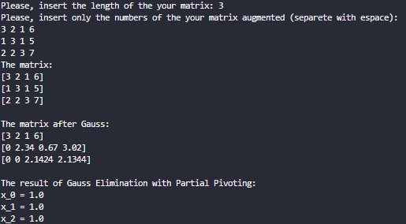
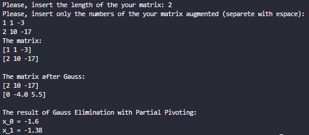

# 📐 Gauss Elimination with Partial Pivoting (Python)

A **Python CLI-based implementation** of **Gauss Elimination with Partial Pivoting** to solve systems of linear equations.  
The program accepts an augmented matrix as input, transforms it into an upper triangular matrix, and computes the solution accurately.

---

## 🚀 Features

- Solves linear systems using Gauss Elimination
- Implements **Partial Pivoting** for numerical stability
- Works for matrices of any size (n × n+1)
- Displays:
  - Original matrix
  - Matrix after Gauss elimination
  - Final values of unknowns
- Simple command-line interaction
- Educational and beginner-friendly

---

## 🧠 Tech Stack

- Python 3.12+
- Core Python only (no external libraries)

---

# Screenshot
Those are some examples:

▶️ Usage

Enter the number of equations

Enter each row of the augmented matrix (space-separated)

The program will:

Apply partial pivoting

Perform Gauss elimination

Display the solution

🎯 Learning Outcomes

Understanding Gauss Elimination

Importance of partial pivoting

Solving linear systems programmatically

Matrix manipulation using Python lists

Algorithmic problem solving

⚠️ Notes

Input must be a valid augmented matrix

The program checks for triangular form validity before solving

👨‍💻 Author

Atul Anand
BCA (Hons)
Amity University, Noida

⭐ Support

If you find this project useful, don’t forget to star ⭐ the repository!

